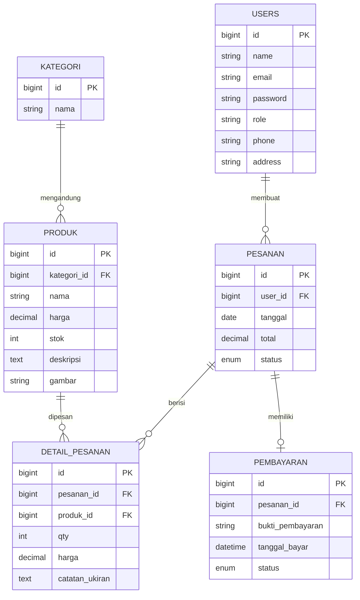

# FILE 1: STRUKTUR DATABASE DAN TABEL
**Sistem Informasi UMKM Berkah Alam**

Dokumen ini mendokumentasikan struktur database, diagram hubungan entitas (ERD), skema tabel, dan relasi antartabel yang digunakan dalam sistem informasi UMKM Berkah Alam.

---

## 1. Entity Relationship Diagram (ERD)

Berikut adalah visualisasi hubungan antartabel di dalam database Berkah Alam:



---

## 2. Deskripsi dan Skema Tabel

Database ini bernama `berkah_alam` dan memiliki 9 tabel utama untuk mendukung proses bisnis e-commerce batu nisan, prasasti, dan monumen kustom.

### 2.1. Tabel `users`
Tabel ini digunakan untuk menyimpan data kredensial dan hak akses pengguna aplikasi (admin dan customer).

| Kolom | Tipe Data | Keterangan |
| :--- | :--- | :--- |
| `id` (PK) | bigint(20) unsigned | Auto-increment, Primary Key |
| `name` | varchar(255) | Nama lengkap pengguna |
| `email` | varchar(255) | Email pengguna (Unique Key) |
| `password` | varchar(255) | Kata sandi yang di-hash dengan Bcrypt |
| `role` | varchar(255) | Peran pengguna (`admin` atau `customer`) |
| `phone` | varchar(20) | Nomor telepon/WhatsApp aktif |
| `address` | text | Alamat lengkap untuk pengiriman/workshop |
| `created_at` / `updated_at` | timestamp | Waktu pembuatan & modifikasi data |

---

### 2.2. Tabel `kategori`
Tabel ini menyimpan kategori produk batu alam (misal: Batu Nisan, Prasasti Peresmian, Monumen, dll.).

| Kolom | Tipe Data | Keterangan |
| :--- | :--- | :--- |
| `id` (PK) | bigint(20) unsigned | Auto-increment, Primary Key |
| `nama` | varchar(255) | Nama kategori (misal: "Batu Nisan") |
| `created_at` / `updated_at` | timestamp | Waktu pembuatan & modifikasi data |

---

### 2.3. Tabel `produk`
Tabel ini menyimpan katalog produk batu alam yang dijual beserta detail harga, stok, dan deskripsinya.

| Kolom | Tipe Data | Keterangan |
| :--- | :--- | :--- |
| `id` (PK) | bigint(20) unsigned | Auto-increment, Primary Key |
| `kategori_id` (FK) | bigint(20) unsigned | Relasi ke `kategori.id` (Cascade) |
| `nama` | varchar(255) | Nama produk (misal: "Nisan Buku Granit Nero") |
| `harga` | decimal(15,2) | Harga produk batu alam |
| `stok` | int(11) | Jumlah stok yang tersedia di workshop |
| `deskripsi` | text | Deskripsi detail bahan baku dan pengerjaan |
| `gambar` | varchar(255) | URL atau path foto produk |
| `created_at` / `updated_at` | timestamp | Waktu pembuatan & modifikasi data |

---

### 2.4. Tabel `pesanan`
Tabel ini mencatat pesanan transaksi yang dilakukan oleh customer.

| Kolom | Tipe Data | Keterangan |
| :--- | :--- | :--- |
| `id` (PK) | bigint(20) unsigned | Auto-increment, Primary Key |
| `user_id` (FK) | bigint(20) unsigned | Relasi ke `users.id` (Cascade) |
| `tanggal` | date | Tanggal transaksi dilakukan |
| `total` | decimal(15,2) | Total harga pesanan keseluruhan |
| `status` | enum('pending', 'diverifikasi', 'diproses', 'selesai', 'ditolak') | Status alur pengerjaan transaksi |
| `created_at` / `updated_at` | timestamp | Waktu pembuatan & modifikasi data |

---

### 2.5. Tabel `detail_pesanan`
Tabel ini berisi detail item produk yang dibeli di dalam suatu nomor pesanan beserta kustomisasi ukiran (karena produk bersifat kustom).

| Kolom | Tipe Data | Keterangan |
| :--- | :--- | :--- |
| `id` (PK) | bigint(20) unsigned | Auto-increment, Primary Key |
| `pesanan_id` (FK) | bigint(20) unsigned | Relasi ke `pesanan.id` (Cascade) |
| `produk_id` (FK) | bigint(20) unsigned | Relasi ke `produk.id` (Cascade) |
| `qty` | int(11) | Kuantitas produk yang dipesan |
| `harga` | decimal(15,2) | Harga produk saat dipesan |
| `catatan_ukiran` | text | Catatan tulisan ukiran nisan (Nama, Lahir, Wafat) |
| `created_at` / `updated_at` | timestamp | Waktu pembuatan & modifikasi data |

---

### 2.6. Tabel `pembayaran`
Tabel ini mencatat unggahan bukti pembayaran transfer dari customer untuk divalidasi oleh admin.

| Kolom | Tipe Data | Keterangan |
| :--- | :--- | :--- |
| `id` (PK) | bigint(20) unsigned | Auto-increment, Primary Key |
| `pesanan_id` (FK) | bigint(20) unsigned | Relasi ke `pesanan.id` (Cascade) |
| `bukti_pembayaran` | varchar(255) | File path bukti transfer bank |
| `tanggal_bayar` | datetime | Waktu customer mengunggah bukti |
| `status` | enum('pending', 'diverifikasi', 'ditolak') | Status verifikasi oleh admin |
| `created_at` / `updated_at` | timestamp | Waktu pembuatan & modifikasi data |

---

### 2.7. Tabel Pendukung Lainnya
*   **Tabel `hero`**: Menyimpan konfigurasi banner promosi di bagian atas Landing Page (judul, subjudul, gambar).
*   **Tabel `galeri`**: Menyimpan koleksi dokumentasi foto hasil karya workshop yang telah selesai dikerjakan.
*   **Tabel `testimoni`**: Menyimpan ulasan kepuasan dari pelanggan beserta rating (1-5).
*   **Tabel `sessions` & `password_reset_tokens`**: Tabel sistem default bawaan Laravel untuk mengelola sesi login web dan pemulihan akun.

---

## 3. Script DDL Database (SQL Dump)

Berikut adalah script DDL lengkap untuk menginisialisasi database di database MySQL/phpMyAdmin:

```sql
-- SQL Dump untuk Sistem Informasi UMKM BERKAH ALAM
-- Dapat diimpor langsung melalui phpMyAdmin

SET SQL_MODE = "NO_AUTO_VALUE_ON_ZERO";
START TRANSACTION;
SET time_zone = "+00:00";

-- Hapus Tabel Jika Sudah Ada (Menghindari Bentrok)
DROP TABLE IF EXISTS `pembayaran`;
DROP TABLE IF EXISTS `detail_pesanan`;
DROP TABLE IF EXISTS `pesanan`;
DROP TABLE IF EXISTS `produk`;
DROP TABLE IF EXISTS `kategori`;
DROP TABLE IF EXISTS `hero`;
DROP TABLE IF EXISTS `galeri`;
DROP TABLE IF EXISTS `testimoni`;
DROP TABLE IF EXISTS `sessions`;
DROP TABLE IF EXISTS `password_reset_tokens`;
DROP TABLE IF EXISTS `users`;

-- 1. Tabel: users
CREATE TABLE `users` (
  `id` bigint(20) UNSIGNED NOT NULL AUTO_INCREMENT,
  `name` varchar(255) NOT NULL,
  `email` varchar(255) NOT NULL,
  `email_verified_at` timestamp NULL DEFAULT NULL,
  `password` varchar(255) NOT NULL,
  `role` varchar(255) NOT NULL DEFAULT 'customer',
  `phone` varchar(20) DEFAULT NULL,
  `address` text DEFAULT NULL,
  `remember_token` varchar(100) DEFAULT NULL,
  `created_at` timestamp NULL DEFAULT NULL,
  `updated_at` timestamp NULL DEFAULT NULL,
  PRIMARY KEY (`id`),
  UNIQUE KEY `users_email_unique` (`email`)
) ENGINE=InnoDB DEFAULT CHARSET=utf8mb4 COLLATE=utf8mb4_unicode_ci;

-- 2. Tabel: kategori
CREATE TABLE `kategori` (
  `id` bigint(20) UNSIGNED NOT NULL AUTO_INCREMENT,
  `nama` varchar(255) NOT NULL,
  `created_at` timestamp NULL DEFAULT NULL,
  `updated_at` timestamp NULL DEFAULT NULL,
  PRIMARY KEY (`id`)
) ENGINE=InnoDB DEFAULT CHARSET=utf8mb4 COLLATE=utf8mb4_unicode_ci;

-- 3. Tabel: produk
CREATE TABLE `produk` (
  `id` bigint(20) UNSIGNED NOT NULL AUTO_INCREMENT,
  `kategori_id` bigint(20) UNSIGNED NOT NULL,
  `nama` varchar(255) NOT NULL,
  `harga` decimal(15,2) NOT NULL,
  `stok` int(11) NOT NULL DEFAULT 0,
  `deskripsi` text DEFAULT NULL,
  `gambar` varchar(255) DEFAULT NULL,
  `created_at` timestamp NULL DEFAULT NULL,
  `updated_at` timestamp NULL DEFAULT NULL,
  PRIMARY KEY (`id`),
  KEY `produk_kategori_id_foreign` (`kategori_id`),
  CONSTRAINT `produk_kategori_id_foreign` FOREIGN KEY (`kategori_id`) REFERENCES `kategori` (`id`) ON DELETE CASCADE
) ENGINE=InnoDB DEFAULT CHARSET=utf8mb4 COLLATE=utf8mb4_unicode_ci;

-- 4. Tabel: pesanan
CREATE TABLE `pesanan` (
  `id` bigint(20) UNSIGNED NOT NULL AUTO_INCREMENT,
  `user_id` bigint(20) UNSIGNED NOT NULL,
  `tanggal` date NOT NULL,
  `total` decimal(15,2) NOT NULL,
  `status` enum('pending','diverifikasi','diproses','selesai','ditolak') NOT NULL DEFAULT 'pending',
  `created_at` timestamp NULL DEFAULT NULL,
  `updated_at` timestamp NULL DEFAULT NULL,
  PRIMARY KEY (`id`),
  KEY `pesanan_user_id_foreign` (`user_id`),
  CONSTRAINT `pesanan_user_id_foreign` FOREIGN KEY (`user_id`) REFERENCES `users` (`id`) ON DELETE CASCADE
) ENGINE=InnoDB DEFAULT CHARSET=utf8mb4 COLLATE=utf8mb4_unicode_ci;

-- 5. Tabel: detail_pesanan
CREATE TABLE `detail_pesanan` (
  `id` bigint(20) UNSIGNED NOT NULL AUTO_INCREMENT,
  `pesanan_id` bigint(20) UNSIGNED NOT NULL,
  `produk_id` bigint(20) UNSIGNED NOT NULL,
  `qty` int(11) NOT NULL,
  `harga` decimal(15,2) NOT NULL,
  `catatan_ukiran` text DEFAULT NULL,
  `created_at` timestamp NULL DEFAULT NULL,
  `updated_at` timestamp NULL DEFAULT NULL,
  PRIMARY KEY (`id`),
  KEY `detail_pesanan_pesanan_id_foreign` (`pesanan_id`),
  KEY `detail_pesanan_produk_id_foreign` (`produk_id`),
  CONSTRAINT `detail_pesanan_pesanan_id_foreign` FOREIGN KEY (`pesanan_id`) REFERENCES `pesanan` (`id`) ON DELETE CASCADE,
  CONSTRAINT `detail_pesanan_produk_id_foreign` FOREIGN KEY (`produk_id`) REFERENCES `produk` (`id`) ON DELETE CASCADE
) ENGINE=InnoDB DEFAULT CHARSET=utf8mb4 COLLATE=utf8mb4_unicode_ci;

-- 6. Tabel: pembayaran
CREATE TABLE `pembayaran` (
  `id` bigint(20) UNSIGNED NOT NULL AUTO_INCREMENT,
  `pesanan_id` bigint(20) UNSIGNED NOT NULL,
  `bukti_pembayaran` varchar(255) NOT NULL,
  `tanggal_bayar` datetime NOT NULL,
  `status` enum('pending','diverifikasi','ditolak') NOT NULL DEFAULT 'pending',
  `created_at` timestamp NULL DEFAULT NULL,
  `updated_at` timestamp NULL DEFAULT NULL,
  PRIMARY KEY (`id`),
  KEY `pembayaran_pesanan_id_foreign` (`pesanan_id`),
  CONSTRAINT `pembayaran_pesanan_id_foreign` FOREIGN KEY (`pesanan_id`) REFERENCES `pesanan` (`id`) ON DELETE CASCADE
) ENGINE=InnoDB DEFAULT CHARSET=utf8mb4 COLLATE=utf8mb4_unicode_ci;

COMMIT;
```
