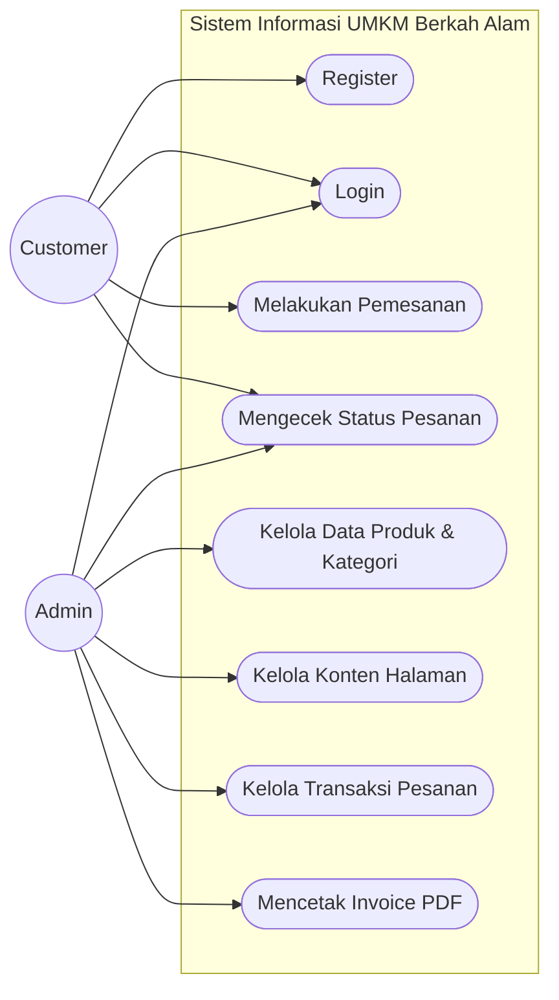
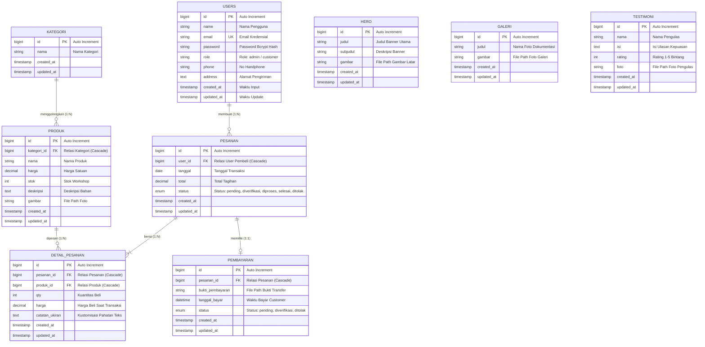

# FILE 4: PERANCANGAN USE CASE DIAGRAM DAN DATABASE
**Sistem Informasi UMKM Berkah Alam**

Dokumen ini mendokumentasikan analisis perancangan sistem informasi UMKM Berkah Alam yang meliputi pemodelan fungsional menggunakan **Use Case Diagram** beserta spesifikasinya, serta perancangan struktural database berupa **Entity Relationship Diagram (ERD)** dan **Kamus Data (Spesifikasi Tabel)**.

---

## 1. Analisis Aktor Sistem (System Actors)

Sistem Informasi UMKM Berkah Alam melibatkan 2 aktor utama yang berinteraksi dengan aplikasi:

| No | Aktor | Deskripsi Peran / Hak Akses |
| :--- | :--- | :--- |
| 1 | **Customer (Pelanggan)** | Pengguna terdaftar (role: `customer`) yang mengakses halaman pemesanan produk kustom, mengisi teks ukiran nisan/prasasti, mengunggah bukti pembayaran, serta memantau status pengerjaan pesanan. |
| 2 | **Admin (Administrator)** | Pengelola internal UMKM Berkah Alam (role: `admin`) dengan hak akses penuh ke dashboard statistik, manajemen produk & kategori, pengelolaan konten halaman depan, verifikasi pembayaran, pemrosesan transaksi, serta pencetakan invoice PDF. |

---

## 2. Pemodelan Use Case Diagram

Diagram Use Case memodelkan interaksi antara aktor (eksternal) dengan fungsi-fungsi utama (internal) yang disediakan oleh sistem informasi Berkah Alam sesuai struktur template 8-use-case vertical stack.

### 2.1. Visualisasi Use Case Diagram (Mermaid)

---

### 2.2. Spesifikasi Use Case (Use Case Specification)

Tabel berikut menjelaskan rincian aksi dan deskripsi dari masing-masing use case yang ada di dalam sistem:

| ID | Nama Use Case | Aktor Utama | Deskripsi Singkat |
| :--- | :--- | :--- | :--- |
| **UC-01** | Register | Customer | Pendaftaran akun baru customer dengan menginput data pribadi (nama, email, password, telepon, dan alamat). |
| **UC-02** | Login | Customer, Admin | Verifikasi email dan kata sandi pengguna untuk masuk log dan mengakses sistem sesuai otorisasi. |
| **UC-03** | Melakukan Pemesanan | Customer | Membuat pesanan baru dengan memilih produk, menentukan kuantitas (qty), alamat kirim, serta menulis detail pahatan kustom. |
| **UC-04** | Mengecek Status Pesanan | Customer, Admin | Memantau perkembangan status verifikasi, pengerjaan pesanan, dan konfirmasi unggahan bukti transfer pembayaran. |
| **UC-05** | Kelola Data Produk & Kategori | Admin | Manajemen CRUD data master kategori batu alam serta detail produk lengkap dengan gambar produk. |
| **UC-06** | Kelola Konten Halaman | Admin | CMS data konten promosi beranda (hero banner), dokumentasi portofolio galeri, serta ulasan kepuasan (testimoni). |
| **UC-07** | Kelola Transaksi Pesanan | Admin | Manajemen status transaksi pesanan masuk (pending, diverifikasi, diproses, selesai, ditolak) dan validasi bukti pembayaran. |
| **UC-08** | Mencetak Invoice PDF | Admin | Mengunduh kwitansi/invoice resmi pesanan pembeli ke dalam format berkas biner PDF. |

---

## 3. Perancangan Database

Rancangan database di bawah ini ditujukan untuk mendukung kebutuhan penyimpanan persisten sistem informasi e-commerce kustom Berkah Alam.

### 3.1. Entity Relationship Diagram (ERD) - Mermaid

Diagram ini menggambarkan hubungan logis dan relasi kardinalitas antartabel database Berkah Alam:

---

### 3.2. Kamus Data & Spesifikasi Detail Tabel

#### 3.2.1. Tabel `users`
Menyimpan data kredensial akun, data pribadi, serta peranan pengguna dalam aplikasi.
*   **Primary Key**: `id`
*   **Unique Key**: `email`

| Nama Kolom | Tipe Data | Nullable | Default | Keterangan |
| :--- | :--- | :--- | :--- | :--- |
| `id` | bigint(20) unsigned | NO | *Auto Increment* | Kunci utama unik user |
| `name` | varchar(255) | NO | - | Nama lengkap pengguna |
| `email` | varchar(255) | NO | - | Alamat email unik login |
| `email_verified_at`| timestamp | YES | NULL | Penanda verifikasi email |
| `password` | varchar(255) | NO | - | Kata sandi terenkripsi Bcrypt |
| `role` | varchar(255) | NO | 'customer' | Peranan hak akses (`admin` / `customer`) |
| `phone` | varchar(20) | YES | NULL | Nomor telepon / WhatsApp |
| `address` | text | YES | NULL | Alamat pengiriman lengkap |
| `remember_token` | varchar(100) | YES | NULL | Token Laravel 'remember me' |
| `created_at` | timestamp | YES | NULL | Waktu pembuatan baris data |
| `updated_at` | timestamp | YES | NULL | Waktu perubahan baris data |

---

#### 3.2.2. Tabel `kategori`
Menyimpan kategori penggolongan produk batu nisan dan prasasti.
*   **Primary Key**: `id`

| Nama Kolom | Tipe Data | Nullable | Default | Keterangan |
| :--- | :--- | :--- | :--- | :--- |
| `id` | bigint(20) unsigned | NO | *Auto Increment* | Kunci utama kategori |
| `nama` | varchar(255) | NO | - | Nama kategori (cth: "Batu Nisan") |
| `created_at` | timestamp | YES | NULL | Waktu data ditambahkan |
| `updated_at` | timestamp | YES | NULL | Waktu data diperbarui |

---

#### 3.2.3. Tabel `produk`
Menyimpan detail katalog produk batu alam beserta stok dan harganya.
*   **Primary Key**: `id`
*   **Foreign Key**: `kategori_id` merujuk ke `kategori(id)` dengan opsi `ON DELETE CASCADE`.

| Nama Kolom | Tipe Data | Nullable | Default | Keterangan |
| :--- | :--- | :--- | :--- | :--- |
| `id` | bigint(20) unsigned | NO | *Auto Increment* | Kunci utama produk |
| `kategori_id` | bigint(20) unsigned | NO | - | Penghubung ke kategori produk |
| `nama` | varchar(255) | NO | - | Nama produk batu alam |
| `harga` | decimal(15,2) | NO | - | Harga jual produk |
| `stok` | int(11) | NO | 0 | Sisa stok barang di workshop |
| `deskripsi` | text | YES | NULL | Penjelasan bahan, ukuran, dll. |
| `gambar` | varchar(255) | YES | NULL | File path gambar produk |
| `created_at` | timestamp | YES | NULL | Waktu data ditambahkan |
| `updated_at` | timestamp | YES | NULL | Waktu data diperbarui |

---

#### 3.2.4. Tabel `pesanan`
Menyimpan data ringkasan transaksi pemesanan yang dilakukan oleh customer.
*   **Primary Key**: `id`
*   **Foreign Key**: `user_id` merujuk ke `users(id)` dengan opsi `ON DELETE CASCADE`.

| Nama Kolom | Tipe Data | Nullable | Default | Keterangan |
| :--- | :--- | :--- | :--- | :--- |
| `id` | bigint(20) unsigned | NO | *Auto Increment* | Nomor Invoice / Kunci utama |
| `user_id` | bigint(20) unsigned | NO | - | Id customer pembuat pesanan |
| `tanggal` | date | NO | - | Tanggal dibuatnya transaksi |
| `total` | decimal(15,2) | NO | - | Jumlah total tagihan keseluruhan |
| `status` | enum(...) | NO | 'pending' | Status pesanan: `pending`, `diverifikasi`, `diproses`, `selesai`, `ditolak` |
| `created_at` | timestamp | YES | NULL | Waktu transaksi diinput |
| `updated_at` | timestamp | YES | NULL | Waktu status pesanan diubah |

---

#### 3.2.5. Tabel `detail_pesanan`
Menyimpan rincian item produk di dalam transaksi pesanan beserta teks ukiran kustom nisan/prasasti.
*   **Primary Key**: `id`
*   **Foreign Key**:
    *   `pesanan_id` merujuk ke `pesanan(id)` dengan opsi `ON DELETE CASCADE`.
    *   `produk_id` merujuk ke `produk(id)` dengan opsi `ON DELETE CASCADE`.

| Nama Kolom | Tipe Data | Nullable | Default | Keterangan |
| :--- | :--- | :--- | :--- | :--- |
| `id` | bigint(20) unsigned | NO | *Auto Increment* | Kunci utama detail |
| `pesanan_id` | bigint(20) unsigned | NO | - | Penghubung ke header pesanan |
| `produk_id` | bigint(20) unsigned | NO | - | Penghubung ke produk yang dipesan |
| `qty` | int(11) | NO | - | Kuantitas produk dipesan |
| `harga` | decimal(15,2) | NO | - | Harga produk saat dibeli |
| `catatan_ukiran` | text | YES | NULL | Tulisan kustom (nama, lahir, wafat) |
| `created_at` | timestamp | YES | NULL | Waktu data ditambahkan |
| `updated_at` | timestamp | YES | NULL | Waktu data diperbarui |

---

#### 3.2.6. Tabel `pembayaran`
Menyimpan data bukti pembayaran transfer bank yang dikirimkan oleh customer.
*   **Primary Key**: `id`
*   **Foreign Key**: `pesanan_id` merujuk ke `pesanan(id)` dengan opsi `ON DELETE CASCADE`.

| Nama Kolom | Tipe Data | Nullable | Default | Keterangan |
| :--- | :--- | :--- | :--- | :--- |
| `id` | bigint(20) unsigned | NO | *Auto Increment* | Kunci utama pembayaran |
| `pesanan_id` | bigint(20) unsigned | NO | - | Penghubung ke pesanan |
| `bukti_pembayaran` | varchar(255) | NO | - | File path gambar bukti transfer |
| `tanggal_bayar` | datetime | NO | - | Waktu unggah bukti bayar |
| `status` | enum(...) | NO | 'pending' | Status bukti transfer: `pending`, `diverifikasi`, `ditolak` |
| `created_at` | timestamp | YES | NULL | Waktu data ditambahkan |
| `updated_at` | timestamp | YES | NULL | Waktu data diperbarui |

---

#### 3.2.7. Tabel `hero`
Menyimpan data CMS teks banner ucapan selamat datang di Landing Page.
*   **Primary Key**: `id`

| Nama Kolom | Tipe Data | Nullable | Default | Keterangan |
| :--- | :--- | :--- | :--- | :--- |
| `id` | bigint(20) unsigned | NO | *Auto Increment* | Kunci utama banner |
| `judul` | varchar(255) | NO | - | Judul utama banner |
| `subjudul` | varchar(255) | NO | - | Subjudul penjelasan |
| `gambar` | varchar(255) | NO | - | URL / path gambar latar banner |
| `created_at` | timestamp | YES | NULL | Waktu data ditambahkan |
| `updated_at` | timestamp | YES | NULL | Waktu data diperbarui |

---

#### 3.2.8. Tabel `galeri`
Menyimpan data portofolio hasil karya workshop batu nisan/prasasti.
*   **Primary Key**: `id`

| Nama Kolom | Tipe Data | Nullable | Default | Keterangan |
| :--- | :--- | :--- | :--- | :--- |
| `id` | bigint(20) unsigned | NO | *Auto Increment* | Kunci utama galeri |
| `judul` | varchar(255) | NO | - | Judul deskripsi gambar |
| `gambar` | varchar(255) | NO | - | URL / path file foto pengerjaan |
| `created_at` | timestamp | YES | NULL | Waktu data ditambahkan |
| `updated_at` | timestamp | YES | NULL | Waktu data diperbarui |

---

#### 3.2.9. Tabel `testimoni`
Menyimpan ulasan dan rating dari pelanggan pasca memesan.
*   **Primary Key**: `id`

| Nama Kolom | Tipe Data | Nullable | Default | Keterangan |
| :--- | :--- | :--- | :--- | :--- |
| `id` | bigint(20) unsigned | NO | *Auto Increment* | Kunci utama ulasan |
| `nama` | varchar(255) | NO | - | Nama lengkap pengulas |
| `isi` | text | NO | - | Ulasan tertulis kepuasan pelanggan |
| `rating` | int(11) | NO | 5 | Skala rating kepuasan (1 sampai 5) |
| `foto` | varchar(255) | YES | NULL | URL / path foto profil pengulas |
| `created_at` | timestamp | YES | NULL | Waktu ulasan diinput |
| `updated_at` | timestamp | YES | NULL | Waktu ulasan diperbarui |

---

## 4. Penjelasan Integritas Data & Aturan Relasi

Untuk menjamin konsistensi dan integritas data (agar tidak terjadi data yatim/piatu atau *orphaned data*), database menggunakan aturan **Integritas Referensial** (Foreign Key Constraints) dengan konfigurasi berikut:

1.  **Relasi Kategori ke Produk (`kategori` -> `produk`)**
    *   Menggunakan constraint `kategori_id` pada tabel `produk` yang merujuk ke tabel `kategori`.
    *   Dilengkapi dengan aturan `ON DELETE CASCADE`. Apabila admin menghapus sebuah kategori (misal: "Relief & Ukiran"), maka semua produk yang tergolong dalam kategori tersebut otomatis ikut terhapus dari database.
2.  **Relasi Users ke Pesanan (`users` -> `pesanan`)**
    *   Menggunakan constraint `user_id` pada tabel `pesanan` yang merujuk ke tabel `users`.
    *   Dilengkapi dengan aturan `ON DELETE CASCADE`. Apabila data customer dihapus, riwayat transaksinya otomatis dibersihkan agar tidak menyisakan record tidak bertuan.
3.  **Relasi Pesanan ke Detail Pesanan (`pesanan` -> `detail_pesanan`)**
    *   Menggunakan constraint `pesanan_id` pada tabel `detail_pesanan` yang merujuk ke tabel `pesanan`.
    *   Dilengkapi dengan aturan `ON DELETE CASCADE`. Apabila pesanan dihapus oleh admin, semua item rincian pesanan dan kustomisasi tulisan pahatannya otomatis ikut terhapus.
4.  **Relasi Produk ke Detail Pesanan (`produk` -> `detail_pesanan`)**
    *   Menggunakan constraint `produk_id` pada tabel `detail_pesanan` yang merujuk ke tabel `produk`.
    *   Dilengkapi dengan aturan `ON DELETE CASCADE`.
5.  **Relasi Pesanan ke Pembayaran (`pesanan` -> `pembayaran`)**
    *   Menggunakan relasi satu-ke-satu (*one-to-one*) via `pesanan_id` di tabel `pembayaran` merujuk ke `pesanan`.
    *   Dilengkapi dengan aturan `ON DELETE CASCADE` sehingga berkas unggahan bukti transfer ikut terhapus secara otomatis jika transaksinya dihapus dari database.
